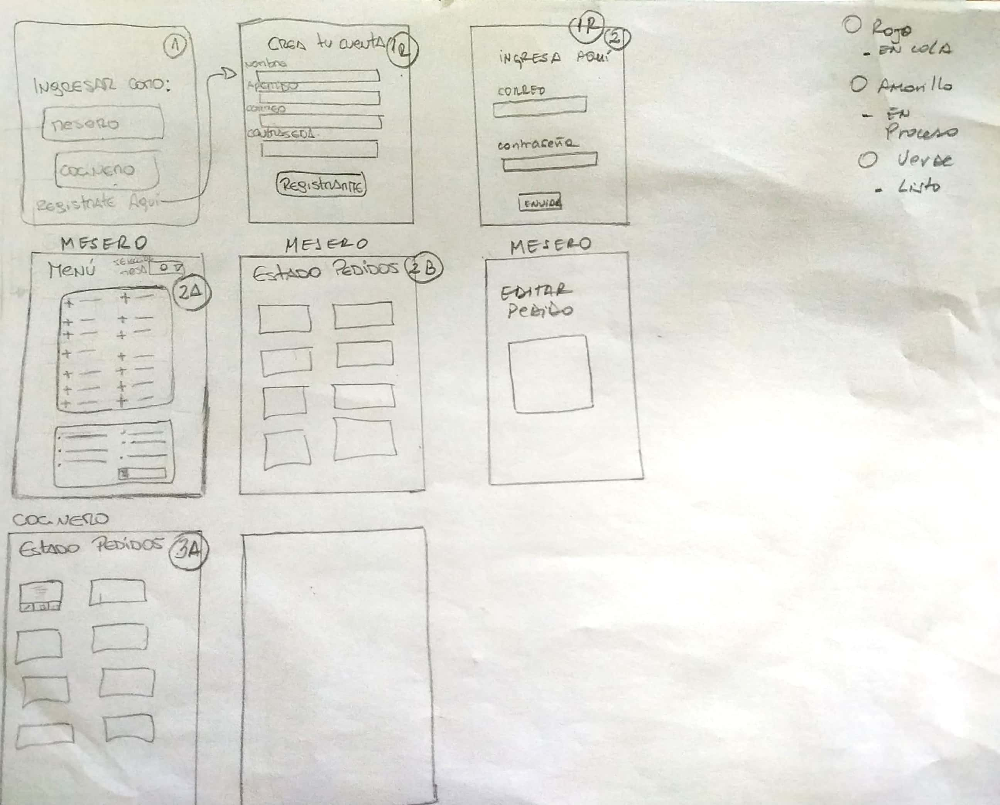
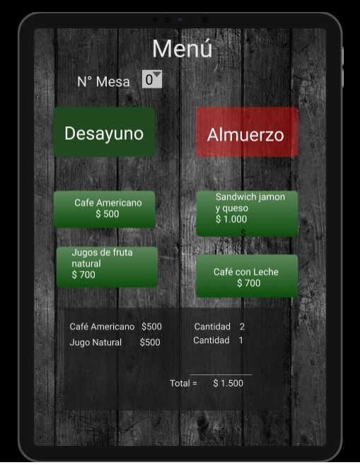

## Burguer Queen 🍔

La presente Aplicación fue pensada principalmente para ser la solucion para meseros y chefs que integran un restaurante, con el propósito que puedan compartir la información de cada solicitud de pedido logrando de esta manera una comunicación fluida y eficiente, mejorando así tanto la atención prestada cómo los tiempos de entrega.

En esta entrega de Burguer Queen, cómo equipo intentamos entregar soluciones fácilmente legibles a los miembros del equipo, por lo cual se presentan a continuación los primeros bocetos de la App. 

Posterior a la iteracion realizada con una usuaria, llegamos a la conclusión que debíamos entregar una solución que no requiera tener una cuanta para así poder tener acceso a ella, eficientando así los tiempos de ejecución y entrega de cada pedido. }

Se presenta con ello, nuestro prototipo de alta fidelidad con el cual pudimos comenzar a trabajar en la creación de nuestra solución, la cual responde a la primera historia de usuario:

"Yo como mesero o mesara debería poder tomar la orden de un cliente para saber fácilmente cuanto cobrar y que la cocina tenga las órdenes de manera inmediata y según cuando van llegando." 

La definicion de estilos utilizados en la misma, se ideó a partir de la necesidad de entregar a nuestros usuarios la posibilidad de pensar en una mesa donde sea asociada al restaurant, y los colores (rojo y verde) sean intuitivamente asociados a avanzar y/o detenerse. 
lo cual se puede apreciar de mejor manera en nuestro prototipo de Alta fidelidad, que se encuentra en [Figma](https://www.figma.com/file/RMO74ojjpmtB91lEuPj77r/Untitled?node-id=0%3A1)

## Planificación ⏳

Para poder organizar nuestros tiempos como equipo e intentar una mayor respuesta a la completitud del proyecto utilizamos [Trello](https://trello.com/b/0GlcxHDF/burguer-queen).

## Herramientas Utilizadas ⚙

- HTML5

- CSS3

- BOOTSTRAP

- REACTJS

## Desarrolladoras 👩🏻‍💻👩🏻‍💻👩🏻‍💻

- Camila Rojas S.

- Verónica Urrutia A. 

- Karen Zúñiga C.  
